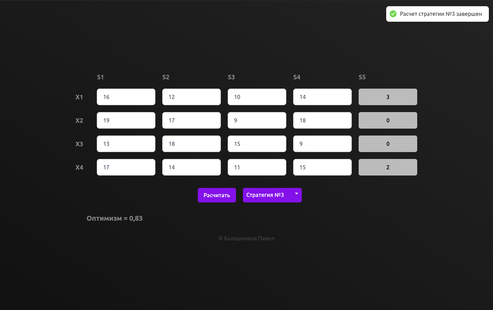

<br>

<p>
  This project is built upon <a href="https://electron-react-boilerplate.js.org/">Electron React Boilerplate</a> which uses <a href="https://electron.atom.io/">Electron</a>, Typescript, Tailwind, React, Webpack and React Fast Refresh.
</p>

## Starting Development

Start the app in the `dev` environment:

```bash
npm start
```

## Packaging for Production

To package apps for the local platform:

```bash
npm run package
```

## Docs

See our [docs and guides here](https://electron-react-boilerplate.js.org/docs/installation)
